# Ollama App

A modern and easy-to-use client for Ollama. Have the greatest experience while keeping everything private and in your local network.

| 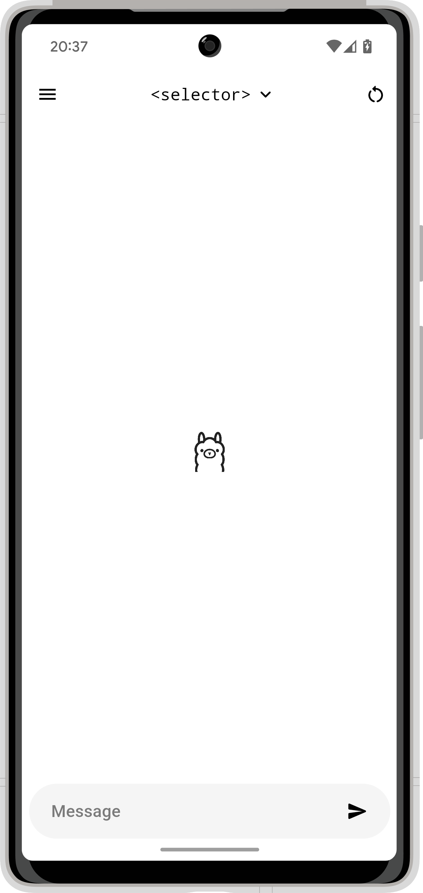 | 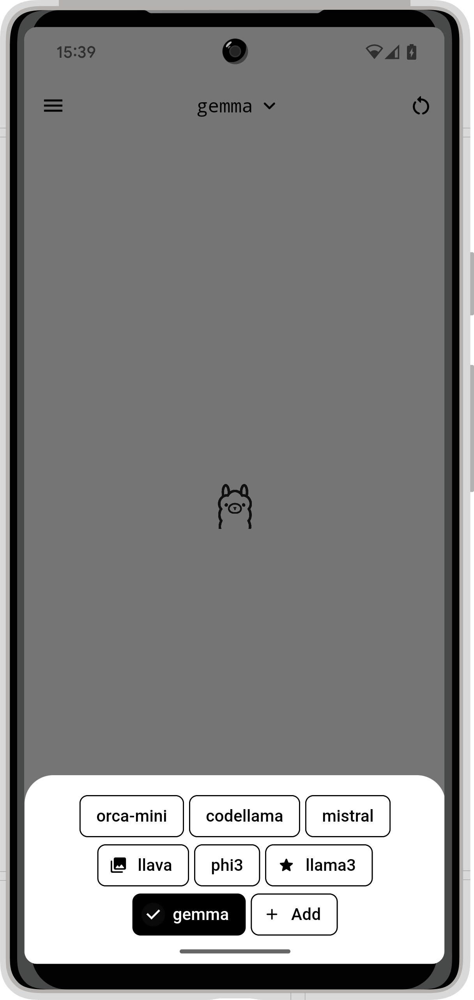 | 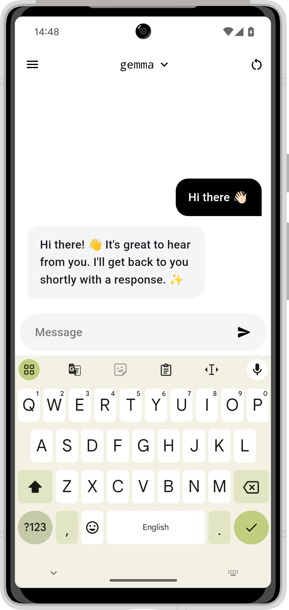 | 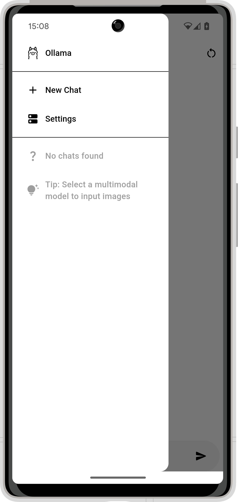 |
|-|-|-|-|

> Important: This app does not host a Ollama server on device, but rather connects to one and uses its api endpoint.
> Don't know what Ollama is? Learn more at [ollama.com](https://ollama.com/).

- [Ollama App](#ollama-app)
  - [Installation](#installation)
  - [Initial Setup](#initial-setup)
  - [Side Menu](#side-menu)
  - [Model Selector](#model-selector)
  - [Multimodal Model Input](#multimodal-model-input)
  - [Multilingual Interface](#multilingual-interface)
  - [Custom Builds](#custom-builds)
    - [Actually Building](#actually-building)

## Installation

You'll find the latest recommended version of the Ollama App under [the releases tab](https://github.com/JHubi1/ollama-app/releases). Download the APK and install it on your Android device. That's it, now proceed to [Initial Setup](#initial-setup).

Alternatively, you can also download the app from any of the following stores:

[](https://apt.izzysoft.de/fdroid/index/apk/com.freakurl.apps.ollama/)

## Initial Setup

After installing the app and opening it for the first time, you'll encounter this popup:

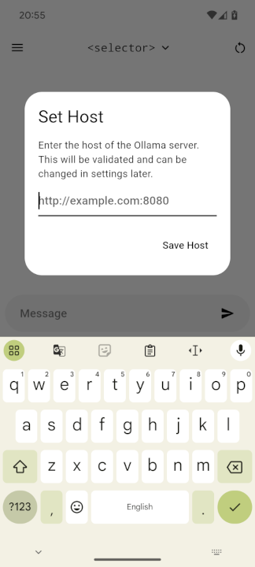

Go through the welcome dialog one by one, you should read their content, but you don't have to.

| 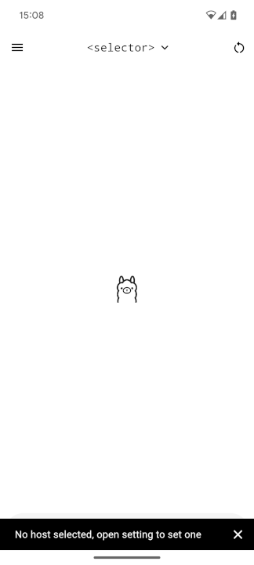 | 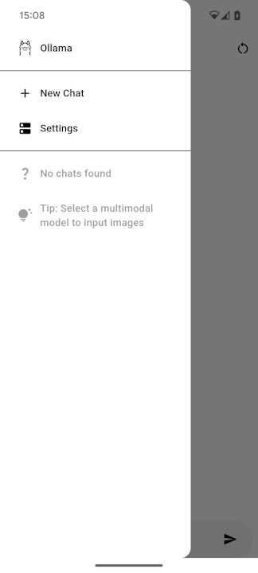 |  |
|-|-|-|

After going through that, you'll get a small snack bar notifying you that you have to set the host. For that, open the sidebar (swipe from the left to right or click the icon in the top left corner) and click on settings. There you'll find all app-related settings, you should go through them, but for the initial setup, only the first one is important.

In the bit host text field, you have to enter the base URL of your instance. The port is required, except for the port number matching the protocol (443 for HTTPS or 80 for HTTP). After that, click the save icon right next to the text field.

This address will be checked, so no worry about entering the wrong one. The disadvantage of this is that your server has to be running even if you don't want to chat with it at that moment. If you set the host once, and your server is offline, the requests will fail, but the host will stay saved if you don't change it yourself. Don't worry, just go into the side menu and click the settings button to change it.

That's it, you can now just chat. Enter a message into the box at the bottom and click the send icon.

## Side Menu

The button on the top left opens the menu. In it, you have two options: `New Chat` and `Settings`. The first option creates a new chat, and the second one opens the settings screen where you can change how everything works.

Below that are all the chats. To delete one, swipe it from left to right. To rename the chat tab and hold it until a popup dialog appears. In it, you can change the title or tab the sparkle icon to let AI find one for you. This is not affected by the "generate title" setting.

| | 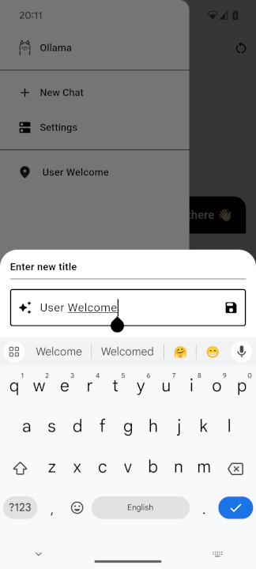 |
|-|-|

> Note: The button on the top right corner deletes the chat. It has the same effect as swiping the chat in the sidebar.

## Model Selector

You can access the model selector by tapping on the `<selector>` text in the top middle or the name of the currently selected model in the same spot. Then you'll get the following bottom sheet:

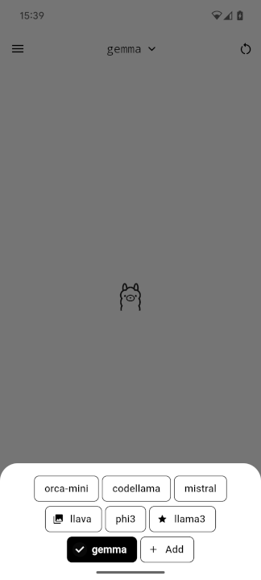

This will display all the models currently installed in your Ollama server instance.

Models with an image-like icon next to them allow multimodal input. The one shown in the image, `llava`, supports exactly that.

The models with a star next to them are recommended models. They have been selected by me (hehe) to be listed as that. Read more under [Custom Builds](#custom-builds).

The `Add` button does nothing at the moment, it just opens a snack bar listing steps on how to add a model to an instance. For safety reasons, I didn't add the ability to add a model directly via name in the app.

## Multimodal Model Input

Ollama App supports multimodal models, models with support input via an image.

After selecting a supported model, as describes in [Model Selector](#model-selector), a new icon appears at the bottom left of the message bar; a camera icon. Clicking on it reveals the following bottom sheet:

| 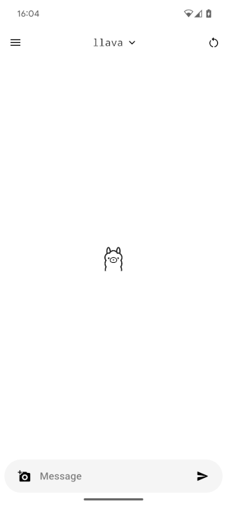 | 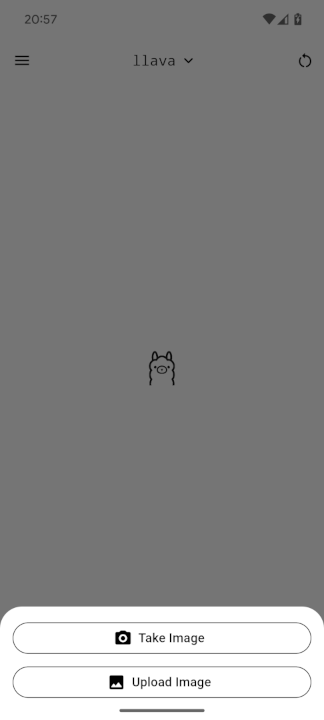 |
|-|-|

Select one of them, take or select your photo and it'll get added to the chat. You can also add multiple.

Even though the images will appear in the chat already after sending, they won't be submitted to the AI until a new text message is sent.

## Multilingual Interface

I integrated support for multiple languages into the Ollama App. Currently available are:

- English
- German

Your language isn't one of them? Reach out to me and I'll give you access to my Crowdin project.

## Custom Builds

Now comes the interesting part. I built this app in a way you can easily create custom builds. Currently, there are these values that can be customized:

```
// use host or not, if false dialog is shown
const useHost = false;
// host of ollama, must be accessible from the client, without trailing slash, will always be accepted as valid
const fixedHost = "http://example.com:11434";
// use model or not, if false selector is shown
const useModel = false;
// model name as string, must be valid ollama model!
const fixedModel = "gemma";
// recommended models, shown with as star in model selector
const recommendedModels = ["gemma", "llama3"];
// allow opening of settings
const allowSettings = true;
// allow multiple chats
const allowMultipleChats = true;
```

They can be found at the top of `lib/main.dart`. `useHost` and `useModel` decide whether you want `fixedHost` and `fixedModel` to control anything. `fixedHost` and `fixedModel` decide about the value that has to be used. That can be practical in case you try to create an app specific to your instance.

`recommendedModels` is a list of models that will be listed as recommended in the [Model Selector](#model-selector). They are more like personal preferences. If empty, no model will be preferred.

`allowSettings` will disable the settings screen. But it will also disable the welcome dialog at first startup and the ability to rename chats.

`allowMultipleChats` simply removes the `New Chat` option in the [Side Menu](#side-menu). And will load up the only available chat on app startup.

### Actually Building

But how do you create a custom build?

First, follow [the Flutter installation guide](https://docs.flutter.dev/get-started/install) by selecting Android as the first app type. Then follow [these steps](https://docs.flutter.dev/deployment/android#signing-the-app) till you have your custom `key.properties`. Place it into the `android` folder at the root of the project.

If you're running on Windows, just double-click on `scripts/build.bat` and wait till the process is done. Don't worry, there'll be a lot of Kotlin errors in the terminal. You can safely ignore them, the build will be fine.

If you're not running Windows, open the file `scripts/build.bat` in a text editor and copy the command starting with `flutter` after the `call` command in a terminal window. Again, don't worry about the Kotlin errors.

In both cases, you'll now find your APK in `build/app/outputs/apk/release/app-release.apk` (don't blame me for that, it's a flutter thing).