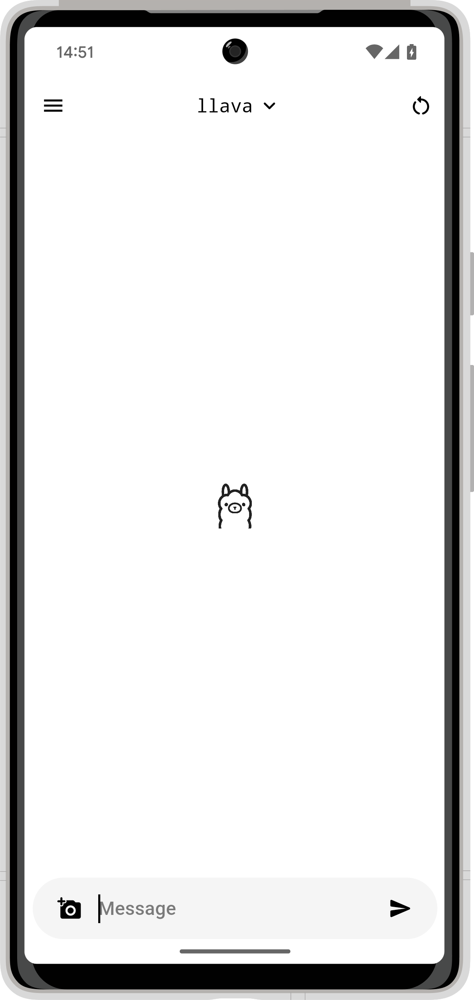

# Ollama App

A modern and easy-to-use client for Ollama. Have the greatest experience while keeping everything private and in your local network.

|  |  |  |  |
|-|-|-|-|

> Important: This app does not host a Ollama server on device, but rather connects to one and uses its api endpoint.
> Don't know what Ollama is? Learn more at [ollama.com](https://ollama.com/).

- [Ollama App](#ollama-app)
  - [Installation](#installation)
  - [Initial Setup](#initial-setup)
  - [Side Menu](#side-menu)
  - [Model Selector](#model-selector)
  - [Multimodal Model Input](#multimodal-model-input)
  - [Multilingual Interface](#multilingual-interface)
  - [Custom Builds](#custom-builds)
    - [Actually Building](#actually-building)

## Installation

You'll find the latest recommended version of the Ollama App under [the releases tab](https://github.com/JHubi1/ollama-app/releases). Download the APK and install it on your Android device. That's it, now proceed to [Initial Setup](#initial-setup).

## Initial Setup

After installing the app and opening it for the first time, you'll encounter this popup:


In this dialog, you have to enter the base URL of your instance. The port is required, except for the port number matching the protocol (443 for HTTPS or 80 for HTTP).

This address will be checked, so no worry about entering the wrong one. The disadvantage of this is that your server has to be running even if you don't want to chat with it at that moment. The checkup only happens on initial setup for now. If you move your server or the server goes down and you try to send a message to it, there is a chance of the app crashing. Don't worry, just go into the side menu and click the settings button to change it.

That's it, you can now just chat. Enter a message into the box at the bottom and click the send icon.

## Side Menu

The button on the top left opens the menu. In it, you have two options for now: `New Chat` and `Settings`. The first option clears the chat (-> creates a new one), and the second one reopens the host dialog from the initial start of the app to adapt to changing hosts.


Note: The same effect as the `New Chat` option has the button on the top right of the main screen.


## Model Selector

You can access the model selector by tapping on the `<selector>` text in the top middle or the name of the currently selected model in the same spot. Then you'll get the following bottom sheet:


This will display all the models currently installed in your Ollama server instance.

Models with an image-like icon next to them allow multimodal input. The one shown in the image, `llava`, supports exactly that.

The models with a star next to them are recommended models. They have been selected by me (hehe) to be listed as that. Read more under [Custom Builds](#custom-builds).

The `Add Model` button does nothing at the moment, it just opens a dialog that lists steps on how to add a model to an instance. For safety reasons, I didn't add the ability to add a model directly via name in the app.

## Multimodal Model Input

Ollama App supports multimodal models, models with support input via an image.

After selecting one in the model selector, a new icon appears at the bottom left of the message bar; a camera icon. Clicking on it reveals the following bottom sheet:


Select one of them, take your photo and it'll get added to the chat. You can also add multiple.

Even though the images will appear in the chat already after sending, they won't be submitted to the AI until a new text message is sent.

## Multilingual Interface

I integrated support for multiple languages into the Ollama App. Currently available are:

- English
- German

Your language isn't one of them? Reach out to me and I'll give you access to my Crowdin project.

## Custom Builds

Now comes the interesting part. I built this app in a way you can easily create custom builds. Currently, there are these values that can be customized:

```
// use host or not, if false dialog is shown
const useHost = false;
// host of ollama, must be accessible from the client, without trailing slash
const fixedHost = "http://example.com:1144";
// use model or not, if false selector is shown
const useModel = false;
// model name as string, must be valid ollama model!
const fixedModel = "gemma";
// recommended models, shown with as star in model selector
const recommendedModels = ["gemma", "llama3"];
```

They can be found at the top of `lib/main.dart`. `useHost` and `useModel` decide whether you want `fixedHost` and `fixedModel` to control anything. `fixedHost` and `fixedModel` decide about the value that has to be used. That can be practical in case you try to create an app specific to your instance.

The last one, `recommendedModels`, is a list of models that will be listed as recommended in the [Model Selector](#model-selector). They are more like personal preferences. If empty, no model will be preferred.

### Actually Building

But how do you create a custom build?

First, follow [the Flutter installation guide](https://docs.flutter.dev/get-started/install) by selecting Android as the first app type. Then follow [these steps](https://docs.flutter.dev/deployment/android#signing-the-app) till you have your custom `key.properties`. Place it into the `android` folder at the root of the project.

If you're running on Windows, just double-click on `scripts/build.bat` and wait till the process is done. Don't worry, there'll be a lot of Kotlin errors in the terminal. You can safely ignore them, the build will be fine.

If you're not running Windows, open the file `scripts/build.bat` in a text editor and copy the command starting with `flutter` after the `call` command in a terminal window. Again, don't worry about the Kotlin errors.

In both cases, you'll now find your APK in `build/app/outputs/apk/release/app-release.apk` (don't blame me for that, it's a flutter thing).